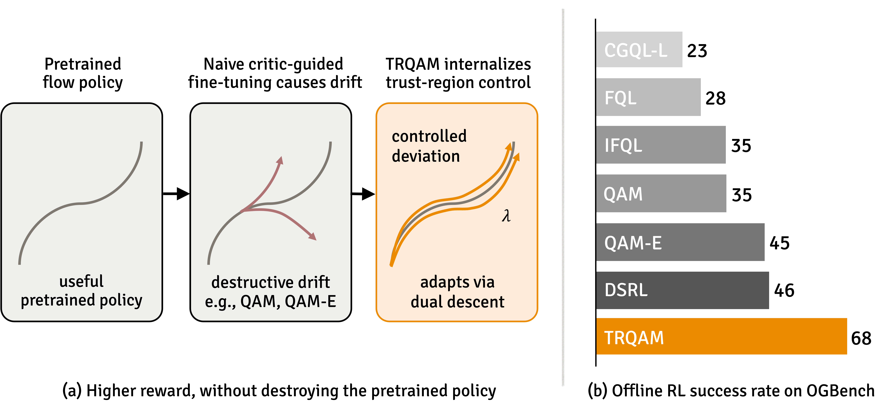

<h1 align="center"> Trust Region Q Adjoint Matching </h1>

<div align="center">
  <a href="https://yonghdong.github.io" target="_blank">Yonghoon&nbsp;Dong</a><sup>1</sup> &ensp; <b>&middot;</b> &ensp;
  <a href="https://kyungmnlee.github.io/" target="_blank">Kyungmin&nbsp;Lee</a><sup>1</sup> &ensp; <b>&middot;</b> &ensp;
  <a href="https://changyeon.site/" target="_blank">Changyeon&nbsp;Kim</a><sup>1</sup> &ensp; <b>&middot;</b> &ensp;
  <a href="#" target="_blank">Jaehyuk&nbsp;Kim</a><sup>2</sup> &ensp; <b>&middot;</b> &ensp;
  <a href="https://alinlab.kaist.ac.kr/shin.html" target="_blank">Jinwoo&nbsp;Shin</a><sup>1,3</sup>
  <br>
  <sup>1</sup>KAIST &emsp; <sup>2</sup>Seoul National University &emsp; <sup>3</sup>RLWRLD &emsp; <br>
</div>

<h3 align="center"><a href="https://arxiv.org/abs/2605.27079">Paper</a> &emsp; <a href="https://yonghdong.github.io/blog/trqam/">Blog</a></h3>


<p align="center">
  
</p>

<b>Summary</b>: Trust Region Q Adjoint Matching (TRQAM) is a stable off-policy RL algorithm for fine-tuning pretrained flow policies under a path-space KL trust region against the pretrained policy, enforced via dual descent. On 50 OGBench tasks, TRQAM reaches 68% aggregate offline success, compared to 46% for the strongest baseline.

## Installation

1. **Create and activate a conda environment:**
   ```bash
   conda create -n trqam python=3.11 -y
   conda activate trqam
   ```

2. **Install robomimic from source:**
   ```bash
   git clone https://github.com/ARISE-Initiative/robomimic.git
   cd robomimic
   pip install -e .
   cd ..
   ```

3. **Install robosuite from source:**
   ```bash
   git clone https://github.com/ARISE-Initiative/robosuite.git
   cd robosuite
   pip install -r requirements.txt
   cd ..
   ```

4. **Patch robomimic for JAX compatibility** (makes an unused `diffusers` import non-fatal):
   ```bash
   python -c "
   path = '$HOME/robomimic/robomimic/algo/__init__.py'
   with open(path) as f:
       text = f.read()
   old = 'from robomimic.algo.diffusion_policy import DiffusionPolicyUNet'
   new = '''try:
       from robomimic.algo.diffusion_policy import DiffusionPolicyUNet
   except (ImportError, AttributeError):
       pass'''
   with open(path, 'w') as f:
       f.write(text.replace(old, new))
   print('Done')
   "
   ```

5. **Install TRQAM dependencies:**
   ```bash
   pip install -r requirements.txt
   ```


## Reproducing paper results

The paper's pipeline is two-stage: **(1)** pretrain a flow policy with behavior cloning (BC) for 300K steps, then **(2)** fine-tune it with TRQAM (or a baseline) for 1M offline + 500K online steps, loading the BC checkpoint as the initialization.

The key TRQAM hyperparameter is `--agent.kl_budget` (`ε_KL` in the paper); see Table 4 of the paper for per-domain recommended values.

<details>
<summary><b>Network size</b> (per-domain widths and layer norm)</summary>

- **1M data domains** (e.g. `antmaze-large`, `humanoidmaze-*`, `cube-double`, `scene`, `puzzle-3x3`, Robomimic): width **512**, `actor_layer_norm=False`.
- **10M / 100M data domains** (`cube-triple-10M`, `antmaze-giant-10M`, `puzzle-4x4-10M`, `cube-quadruple-100M`): width **1024**, `actor_layer_norm=True`.

The default agent configs ship with the 1M setting. For 10M/100M data domains, append the following flags to **both** the BC pretrain and fine-tuning commands so the saved checkpoint matches the fine-tuning model:

```bash
--agent.actor_hidden_dims='(1024,1024,1024,1024)' \
--agent.value_hidden_dims='(1024,1024,1024,1024)' \
--agent.actor_layer_norm=True
```

</details>

<details>
<summary><b>Discount and pessimism</b> (fine-tuning only)</summary>

- **Default** (manipulation, antmaze, Robomimic): `--agent.discount=0.995 --agent.rho=0.5`. Matches the shipped agent configs, so no override is needed.
- **humanoidmaze-\*** (longer horizons): `--agent.discount=0.999 --agent.rho=0.0`. Override both flags on humanoidmaze runs.

These only affect the critic update, so they matter for fine-tuning (Step 2) but **not** for BC pretraining (Step 1, where the critic and adjoint matching are skipped). The only Step-1 hyperparameter that must match Step 2 is the network size.

</details>

### Step 1: BC pretraining (300K steps)

Train a BC-only flow policy with the TRQAM agent (`agents/trqam.py --bc_only=True`). The resulting checkpoint at `exp/trqam/bc_pretrain/<env_name>/<exp_name>/params_300000.pkl` is reusable across TRQAM, QAM, QAM-E, FQL, DSRL, CGQL, IFQL.

<details>
<summary>Example command (<code>cube-triple-task2</code>)</summary>

```bash
MUJOCO_GL=egl python main.py --run_group=bc_pretrain --agent=agents/trqam.py --tags=BC --seed=10001 \
  --env_name=cube-triple-play-singletask-task2-v0 --sparse=False --horizon_length=5 \
  --ogbench_dataset_dir=~/.ogbench/data/cube-triple-play-10m-v0 \
  --agent.action_chunking=True --bc_only=True --offline_steps=300000 --online_steps=0 \
  --agent.actor_hidden_dims='(1024,1024,1024,1024)' \
  --agent.value_hidden_dims='(1024,1024,1024,1024)' \
  --agent.actor_layer_norm=True
```

</details>

### Step 2: Off-policy fine-tuning

Load the BC checkpoint via `--pretrained_actor_path`. Network-size flags must match Step 1.

<details>
<summary>Example commands (<code>cube-triple-task2</code>; TRQAM / QAM / QAM-E)</summary>

```bash
# Path to the BC checkpoint from Step 1
BC_CKPT=exp/trqam/bc_pretrain/cube-triple-play-singletask-task2-v0/<exp_name>/params_300000.pkl

# Common flags
COMMON="--env_name=cube-triple-play-singletask-task2-v0 --sparse=False --horizon_length=5 \
        --ogbench_dataset_dir=~/.ogbench/data/cube-triple-play-10m-v0 \
        --agent.action_chunking=True --pretrained_actor_path=$BC_CKPT \
        --agent.actor_hidden_dims='(1024,1024,1024,1024)' \
        --agent.value_hidden_dims='(1024,1024,1024,1024)' --agent.actor_layer_norm=True"

# TRQAM (ours)
MUJOCO_GL=egl python main.py --run_group=reproduce --agent=agents/trqam.py --tags=TRQAM --seed=10001 \
  $COMMON --agent.kl_budget=0.5

# QAM
MUJOCO_GL=egl python main.py --run_group=reproduce --agent=agents/qam.py --tags=QAM --seed=10001 \
  $COMMON --agent.inv_temp=3.0 --agent.fql_alpha=0.0 --agent.edit_scale=0.0

# QAM-E (edit variant)
MUJOCO_GL=egl python main.py --run_group=reproduce --agent=agents/qam.py --tags=QAM_EDIT --seed=10001 \
  $COMMON --agent.inv_temp=3.0 --agent.fql_alpha=0.0 --agent.edit_scale=0.1
```

</details>

## Datasets

<details>
<summary><b>AntMaze-Giant-Navigate 10M Dataset</b></summary>

**Download from Hugging Face:**
```bash
conda activate trqam
pip install huggingface_hub

python -c "
from huggingface_hub import snapshot_download
import shutil, os, glob

# Download dataset
repo_path = snapshot_download(
    repo_id='yonghoon96/antmaze-giant-navigate-10m-v0',
    repo_type='dataset'
)

# Save to ~/.ogbench/data/antmaze-giant-navigate-10m-v0/
target_dir = os.path.expanduser('~/.ogbench/data/antmaze-giant-navigate-10m-v0')
os.makedirs(target_dir, exist_ok=True)

for file in glob.glob(os.path.join(repo_path, '*.npz')):
    shutil.copy(file, target_dir)

print(f'Dataset saved to: {target_dir}')
"
```

**Reproduction:**
Generated using OGBench v1.2.1 with the following commands:
```bash
cd ogbench/data_gen_scripts
wget https://rail.eecs.berkeley.edu/datasets/ogbench/experts.tar.gz
tar xf experts.tar.gz && rm experts.tar.gz

for i in {0..9}; do
  PYTHONPATH="../impls:${PYTHONPATH}" python generate_locomaze.py \
    --env_name=antmaze-giant-v0 \
    --save_path=data/antmaze-giant-navigate-10m-v0/antmaze-giant-navigate-v0-00${i}.npz \
    --dataset_type=navigate \
    --num_episodes=500 \
    --max_episode_steps=2001 \
    --restore_path=experts/ant \
    --restore_epoch=400000 \
    --seed=${i}
done
```

</details>

<details>
<summary><b>Cube-Triple 10M / Puzzle-4x4 10M Datasets</b></summary>

10M subset of the official 100M release:

1. Download `cube-triple-play-100m-v0` and/or `puzzle-4x4-play-100m-v0` from the [horizon-reduction repo](https://github.com/seohongpark/horizon-reduction?tab=readme-ov-file#using-large-datasets).
2. Copy `*-000.npz` through `*-009.npz` into `~/.ogbench/data/cube-triple-play-10m-v0/` (or `puzzle-4x4-play-10m-v0/`), then pass that path via `--ogbench_dataset_dir`.

</details>

<details>
<summary><b>Cube-Quadruple 100M Dataset</b></summary>

For `cube-quadruple-100M-*`, please follow the instructions [here](https://github.com/seohongpark/horizon-reduction?tab=readme-ov-file#using-large-datasets) to obtain the full official 100M release.

</details>

<details>
<summary><b>Robomimic Datasets</b> (lift / can / square, multi-human low-dim)</summary>

```bash
python ~/robomimic/robomimic/scripts/download_datasets.py \
  --download_dir ~/.robomimic/ \
  --tasks lift can square \
  --dataset_types mh \
  --hdf5_types low_dim
```

</details>

## Acknowledgments
This codebase is built on top of [QC](https://github.com/colinqiyangli/qc) and [QAM](https://github.com/ColinQiyangLi/qam).

## BibTeX
```
@article{dong2026trqam,
    title   = {Trust Region Q Adjoint Matching},
    author  = {Dong, Yonghoon and Lee, Kyungmin and Kim, Changyeon and Kim, Jaehyuk and Shin, Jinwoo},
    journal = {arXiv preprint arXiv:2605.27079},
    year    = {2026}
}
```
